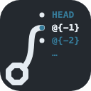

# git-prev-branch

[](https://pkg.go.dev/github.com/matbur/git-prev-branch)
[](https://github.com/matbur/git-prev-branch/releases)
[](LICENSE)
[](https://github.com/matbur/git-prev-branch/actions/workflows/readme-sync.yaml)
[](https://github.com/matbur/git-prev-branch/actions/workflows/ci.yaml)

<p align="center">
  
</p>

**[🇬🇧 English](README.md)** | [🇵🇱 Polski](README.pl.md)

A lightweight CLI tool for Git users, written in Go. `git-prev-branch` helps you quickly determine which branch you switched from to reach your current branch—perfect for automatically setting the base branch when creating pull requests.

## Features

- **Track Git branch history**: Detects the previous active branch based on your Git checkout/switch history.
- **Script-friendly by default**: Writes only the branch name to `stdout` and all prompts to `stderr`, so `$(git-prev-branch)` and pipes capture only the branch name. Use `--yes` (`-y`) to skip the confirmation prompt entirely — without it an interactive terminal is still prompted. See [Output and prompting](#output-and-prompting).
- **Built for GitHub CLI**: Works with `gh pr create --base` and no extra flags — see [Use with GitHub CLI](#use-with-github-cli).
- **Flexible navigation**: Step back through your branch-switching history with a positional index (`0`, `1`, `2`, ...).
- **Works from anywhere**: Target a Git repository in a different directory with the `--path` (`-p`) flag.
- **Customizable behavior**: Configure interactive prompts and defaults via a YAML configuration file.
- **Usable as a Go library**: Import `git-prev-branch` into your own Go tools — see [Use as a Go library](#use-as-a-go-library).

## Installation

You can install `git-prev-branch` using one of the following methods:

> **Note:** Homebrew distribution is planned for later via a separate tap repository (`matbur/homebrew-tap`); see Roadmap.

### 1. Go install

Requires [Go](https://go.dev/dl/) installed on your system.

```bash
go install github.com/matbur/git-prev-branch/cmd/git-prev-branch@latest
```

This will install the binary to your `$GOPATH/bin` (or `$GOBIN`). Make sure it's included in your `PATH`.

### 2. Manual build from source

```bash
git clone https://github.com/matbur/git-prev-branch.git
cd git-prev-branch
go build
```

The resulting binary will be available in the current directory. You can move it to a location in your `PATH`.

### 3. Docker

A ready-made image is published to [Docker Hub](https://hub.docker.com/r/matbur/git-prev-branch): it contains nothing but Git and the `git-prev-branch` binary, and is rebuilt automatically on every merge to `main` and on every `vX.Y.Z` tag. Mount the current repository at `/repo` (the image's work directory) and alias the whole command:

```bash
alias git-prev-branch='docker run --rm -it -v "$PWD":/repo matbur/git-prev-branch'
```

The alias is interactive like the native binary: in a terminal it shows the confirmation prompt, `git-prev-branch -y 2` still works, and exit codes pass through `docker run`. For scripts, drop `-it` (e.g. `docker run --rm -v "$PWD":/repo matbur/git-prev-branch`) — without a terminal on `stdin` the prompt is then skipped automatically. `docker` is the only requirement — neither Git nor Go has to be installed.

A repository outside the current directory needs its own mount (e.g. `-v /path/to/repo:/path/to/repo` together with `--path /path/to/repo`), and a configuration file can be mounted at `/home/uid1000/.config/git-prev-branch`.

## Usage

### Interactive mode

Run without arguments from inside a Git repository:

```bash
git-prev-branch
```

This will:

1. Detect the current branch.
2. Detect the previous active branch (default: 1 step back in branch-switch history).
3. Display information about the previous branch.
4. Prompt you to continue or abort the operation. Aborting exits with code `2` and prints nothing to `stdout` — see [Exit codes](#exit-codes).

### Output and prompting

Two rules cover every invocation:

- `stdout` receives **only the branch name**, always.
- Prompts and other user-facing messages go to `stderr`. The confirmation prompt is shown **if and only if `stdin` is an interactive terminal and `--yes` (`-y`) was not passed**.

When `stdin` is not a terminal — redirected from a file or from another command (`< /dev/null`, `echo | git-prev-branch`, CI) — the prompt is skipped automatically and the branch name is printed immediately. Redirecting or piping `stdout` (`> out.txt`, `| cat`) leaves `stdin` alone, so neither of those suppresses the prompt.

Note that command substitution and a pipe are indistinguishable to the tool: in both cases `stdout` is a pipe while `stdin` is inherited from the calling shell. So `$(git-prev-branch)` run from an interactive terminal **still prompts**, on `stderr`, and waits for your answer before printing the branch name. `git-prev-branch | cat` behaves identically. Pass `--yes` (`-y`) to answer the prompt automatically instead.

#### Exit codes

| Code | Meaning | `stdout` |
|---|---|---|
| `0` | Success | the branch name |
| `1` | Error — not a Git repository, no previous branch, invalid argument, missing or malformed config file | empty |
| `2` | Aborted at the confirmation prompt | empty |

The invariant that matters for scripting: **a non-zero exit always means `stdout` is empty.** Nothing partial is ever emitted before the confirmation is resolved.

Code `2` is only ever produced interactively. When `stdin` is not a terminal the prompt is skipped, so a script can only ever observe `0` or `1`. Passing `-y` likewise reduces the possible outcomes to `0` and `1`.

#### Using it safely in scripts

Shell command substitution discards exit status. `$(...)` expands to whatever the command printed, so a failure silently becomes an empty string instead of stopping your script:

```bash
base=$(git-prev-branch)      # a failure here is invisible: the status is discarded
gh pr create --base "$base"  # ...and this still runs, with --base set to ""
```

Capture the status before using the value:

```bash
base=$(git-prev-branch) && gh pr create --base "$base"
```

or fail fast:

```bash
base=$(git-prev-branch) || exit 1
gh pr create --base "$base"
```

Code `2` lets you tell an abort apart from a genuine error:

```bash
if base=$(git-prev-branch); then
  gh pr create --base "$base"
else
  case $? in
    2) echo "aborted at the confirmation prompt" ;;
    *) echo "could not determine the base branch" >&2; exit 1 ;;
  esac
fi
```

You can also use the explicit `--yes` (`-y`) flag to accept the detection automatically and skip the prompt, regardless of terminal detection:

```bash
git-prev-branch --yes
# or
git-prev-branch -y
```

Since `-y` suppresses the prompt, code `2` cannot occur and the `&&` guard becomes optional.

### Navigate further back in history

You can pass a positional number to go back by `n` steps in your branch-switching history.

| Argument | Meaning |
|---|---|
| `0` | Current branch |
| `1` | Previous active branch (default) |
| `2` | 2 steps back |
| `3` | 3 steps back |
| `...` | `n` steps back |

```bash
git-prev-branch 0
git-prev-branch 1
git-prev-branch 2
```

You can also combine it with `--yes`:

```bash
git-prev-branch -y 2
git-prev-branch -y 0
```

### Specify a repository path

Run against a Git repository in a different directory:

```bash
git-prev-branch -p /path/to/repository
git-prev-branch --path /path/to/repository
```

### Use a custom config file

Override the default configuration locations:

```bash
git-prev-branch -c /path/to/config.yaml
git-prev-branch --config /path/to/config.yaml
```

## Use with GitHub CLI

`git-prev-branch` pairs with [GitHub CLI (`gh`)](https://cli.github.com/) to set the base branch for a new pull request.

```bash
gh pr create --base $(git-prev-branch)
```

No extra flags are required. Run from an interactive terminal you will be asked to confirm the detected branch before `gh` starts — see [Output and prompting](#output-and-prompting). Command substitution is indistinguishable from a pipe here, so the prompt is shown either way. Pass `--yes` (`-y`) if you would rather skip it.

> **Note:** the quotes are deliberately omitted. A Git branch name cannot contain a space, so the expansion needs no quoting — and omitting the quotes also makes it fail loudly: if the command prints nothing, `--base` receives no value at all and `gh` stops with `flag needs an argument: --base`, instead of quietly creating a pull request against an empty base.

## Flags

| Flag | Short | Description |
|---|---|---|
| `--config` | `-c` | Path to a custom configuration file. Overrides both default locations. |
| `--path` | `-p` | Path to the Git repository to analyze. Defaults to the current working directory. |
| `--yes` | `-y` | Accept the detected branch without asking, even on an interactive terminal. `stdout` is unchanged either way — it always receives only the branch name — so this suppresses the prompt, not output or diagnostics. Also makes exit code `2` unreachable. |
| `--debug` | `-d` | Print decisions to `stderr`: which config file was found, or that the built-in defaults apply, and which `git` commands were run and whether they succeeded. `stdout`, prompts and exit codes are unchanged, so scripts can ignore this flag entirely. |
| `--version` | `-v` | Print `git-prev-branch <version>` to `stdout` and exit `0`, without reading the repository or the configuration. The version is resolved at build time: `make build` and `make build-dist` stamp `git describe` (the newest `vX.Y.Z` tag plus distance, the bare commit when no tag is known); otherwise the version comes from the module build info — a binary installed with `go install ...@vX.Y.Z` or `go get` + `go build` reports the module version, a plain `go build` in a git checkout reports the tag or a pseudo-version derived from the repo, and a build without any build info (e.g. outside a repository) reports `dev`. |

> **Note:** If no positional argument is provided, the default step value is `1`. For prompt behavior and stream separation, see [Output and prompting](#output-and-prompting).

## Configuration

`git-prev-branch` reads its configuration from the first location that exists:

### Locations and precedence

```text
--config <path>
<root>/.config/git-prev-branch/config.yaml
~/.config/git-prev-branch/config.yaml
```

Locations are not merged: the first one that exists wins and the rest are ignored. `<root>` is the top level of the work tree, found by walking up from the current directory exactly as Git does; with `--path` (`-p`) the lookup follows that path instead of the current working directory. `~` is the current user's home directory, so the last location is identical on every platform — neither `os.UserConfigDir()` (which resolves to `~/Library/Application Support` on macOS) nor `XDG_CONFIG_HOME` is consulted.

A repository-level file is shared with everyone who clones the repository: commit it if you want those settings for everybody, or add it to that repository's `.gitignore` if it is personal to you.

If `--config` (`-c`) names a file that does not exist, the run fails with exit code `1`. The two default locations are looked up opportunistically — when neither exists, the built-in defaults apply. A malformed file is an error no matter which location it came from.

### Example structure

The following is the configuration structure as implemented today. `default_action` is pinned because the exit codes above depend on it; additional keys may be introduced in future versions.

```yaml
interactive:
  # Behavior when the confirmation prompt is shown
  # Possible values: "accept", "reject"
  default_action: reject
```

- `default_action` — Controls the default response to the interactive confirmation prompt (e.g., whether to accept or reject by default). The shipped default is `reject`, so pressing Enter at the prompt aborts the run (exit code `2`). `--yes` (`-y`) skips the prompt altogether, so it takes precedence over this setting.
- Additional configuration options may be introduced in future versions based on implementation needs.

## Use as a Go library

`git-prev-branch` is designed to be importable as a Go library, allowing you to integrate its branch-detection logic into your own tools.

### Import

```go
import gpb "github.com/matbur/git-prev-branch/gitprevbranch"
```

### Usage

The library exposes two functions in the `gitprevbranch` package: `Previous` resolves against the current working directory, `PreviousIn` against a directory you name. Both return the branch `n` steps back, with `n = 0` meaning the current branch:

```go
prev, err := gpb.Previous(1) // Get previous branch (1 step back)
if err != nil {
    log.Fatal(err)
}
fmt.Println(prev)
```

> **Note:** The command lives in the `cmd/git-prev-branch` package as `package main`, which cannot be imported, so the library is the subpackage `github.com/matbur/git-prev-branch/gitprevbranch`. Failures are reported as sentinel values — `ErrNotGitRepo`, `ErrNoPreviousBranch`, `ErrInvalidIndex`, `ErrGitCommand` — testable with `errors.Is`.

## Development

### Prerequisites

- [Go](https://go.dev/) 1.27 or newer
- [Git](https://git-scm.com/)

### Local development setup

```bash
git clone https://github.com/matbur/git-prev-branch.git
cd git-prev-branch
```

The command lives in `cmd/git-prev-branch/`, the library in `gitprevbranch/`, and configuration handling in `internal/config/`; each package keeps its tests next to it.

> **Note:** `make check` runs every local check — `gofmt`, `go vet`, the Go tests and the Python script checks — and `make help` lists every available target.

## Testing

The test suite covers the tool end to end:

- **Unit tests** – Verify core logic in isolation (branch history resolution, argument parsing, configuration handling, etc.).
- **Integration tests** – Validate behavior against real Git repositories to cover realistic workflows.

> **Note:** the tests build on the standard `testing` package plus `github.com/stretchr/testify` for assertions, and they run against real, temporary Git repositories; start them with `make test`.

## Quality & Automation

To maintain high code quality and streamline releases, the project runs the following automation:

| Area | Approach | Benefits |
|---|---|---|
| **Code CI** | GitHub Actions workflows running tests, linting, and cross-compilation on every push and pull request. | Early detection of regressions and consistent quality checks. |
| **Linting** | Static analysis and style checks (e.g. `golangci-lint`) to enforce Go best practices. | Cleaner, more maintainable codebase. |
| **Multi-platform builds** | Automated cross-compilation for Linux, macOS, and Windows (amd64/arm64). | Broad compatibility for end users. |
| **Versioning tags** | A new `vX.Y.Z` tag on every merge to `main`, bumped by the merged PR's `major`/`minor`/`patch release` label (`patch` when none). | Predictable release points and simple, incremental versioning. |
| **Release publishing** | Automated GitHub Releases (including changelogs and prebuilt binaries). | Simple, predictable distribution. |
| **Docker publishing** | The `Dockerfile` is built and published to Docker Hub on every merge to `main` and on every `vX.Y.Z` tag. | Ready-to-run image; no Git or Go install needed. |
| **Homebrew preparation** | Automated updates to the tap formula as part of the release pipeline. | Seamless updates for Homebrew users. |

> **Note:** the code CI, linting, cross-compilation and release jobs live in `.github/workflows/ci.yaml`, the Docker image in `.github/workflows/docker.yaml`; the Homebrew tap is still to come.

## Roadmap

- [x] Implement core logic to determine previous branch from Git history
- [x] Add CLI argument parsing (positional index and flags)
- [x] Implement script-friendly output (stdout/stderr separation and TTY detection for safe use in `$(...)` and pipes)
- [x] Implement `--yes`/`-y` to accept the detection without prompting
- [x] Add support for custom repository path (`--path`/`-p`)
- [x] Implement configuration file support (repository + user locations, `--config`/`-c` override) with interactive defaults
- [x] Define and stabilize the public Go library API (`github.com/matbur/git-prev-branch/gitprevbranch`)
- [x] Add unit and integration tests
- [x] Set up CI (linting, tests, multi-platform builds)
- [ ] Prepare and publish Homebrew tap and formula
- [ ] Create first stable release with binaries

## Contributing

Contributions are welcome! If you'd like to propose changes, report issues, or suggest improvements:

1. Open an [issue](https://github.com/matbur/git-prev-branch/issues) to discuss your idea.
2. Fork the repository and create a feature branch.
3. Make your changes with clear, well-documented commits.
4. Submit a pull request describing the motivation and scope of your changes.

Please follow standard Go conventions and keep changes consistent with the project's goals and scope. If you edit `README.md`, mirror the change in `README.pl.md` and run the checks before pushing:

```bash
make check
```

`make check` runs `gofmt`, `go vet`, the Go tests and the Python script checks — `scripts/check_readme_sync.py`, `scripts/test_check_readme_sync.py` and `scripts/test_next_tag.py`. The CI jobs it does not run are `lint` (`make lint`, if you have golangci-lint v2 installed), the cross-compiling `build` job and the release-publishing `tag` job. The two README scripts are not interchangeable: the self-tests mutate literal lines copied from both READMEs, so an edit to one of those lines fails there while the sync check still passes.

## License

This project is licensed under the MIT License. See the [LICENSE](LICENSE) file for details.
